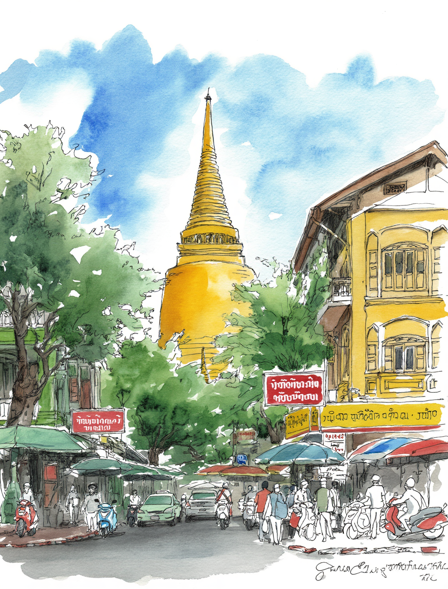

# พระปฐมเจดีย์: อนุสรณ์สถานพุทธศาสนาแห่งแรกของไทย

*พระปฐมเจดีย์ จังหวัดนครปฐม*

พระปฐมเจดีย์ในจังหวัดนครปฐม เป็น**องค์พระเจดีย์ที่สูงที่สุดในประเทศไทย** ด้วยความสูง 120.45 เมตร และได้รับการยกย่องว่าเป็นพระอารามหลวงชั้นเอก ชนิดราชวรมหาวิหาร ซึ่งมีเพียง 6 วัดในประเทศไทยเท่านั้นที่ได้รับเกียรตินี้ สถานที่แห่งนี้ไม่เพียงแต่เป็นสัญลักษณ์ทางสถาปัตยกรรมที่สำคัญ แต่ยังเป็น**จุดเริ่มต้นของพุทธศาสนาในดินแดนไทย** และศูนย์กลางทางจิตวิญญาณที่ยังคงมีชีวิตชีวาในปัจจุบัน

## รากฐานทางประวัติศาสตร์และการสร้างสรรค์

**พระปฐมเจดีย์มีประวัติศาสตร์ยาวนานกว่า 1,500 ปี** โดยองค์เจดีย์เดิมสร้างขึ้นในสมัยทวารวดี ราวศตวรรษที่ 4 ซึ่งหลักฐานทางโบราณคดีชี้ให้เห็นว่าเป็นหนึ่งในสิ่งก่อสร้างทางพุทธศาสนาที่เก่าแก่ที่สุดในเอเชียตะวันออกเฉียงใต้ นครปฐมในสมัยนั้นเป็น**เมืองหลวงที่ใหญ่ที่สุดของอาณาจักรทวารวดี** มีขนาดประมาณ 3.6 x 2 กิโลเมตร และตั้งอยู่ริมชายฝั่งทะเลอ่าวไทยในยุคนั้น

องค์เจดีย์เดิมสร้างด้วยอิฐขนาดใหญ่ เป็นทรงครึ่งวงกลมแบบอินเดีย คล้ายกับพระมหาเจดีย์แห่งสาญจี ที่ตั้งอยู่เหนือพระบรมสารีริกธาตุของพระพุตธเจ้า ซึ่งนำมาโดยพระภิกษุจากอินเดียในสมัยจักรพรรดิอโศก

**การฟื้นฟูครั้งยิ่งใหญ่ในรัชกาลที่ 4** เกิดขึ้นเมื่อปี พ.ศ. 2394 เมื่อสมเด็จพระจอมเกล้าเจ้าอยู่หัว (รัชกาลที่ 4) ซึ่งในขณะนั้นยังเป็นพระองค์ ได้ค้นพบพระเจดีย์โบราณที่ปกคลุมด้วยป่ารกและทรุดโทรม พระองค์จึงทรงริเริ่มโครงการบูรณปฏิสังขรณ์ขนาดใหญ่ที่ใช้เวลา 17 ปี (พ.ศ. 2394-2411) โดยทรง**สร้างองค์เจดีย์ใหม่ครอบทับองค์เก่าทั้งหมด** เพื่อรักษาโครงสร้างโบราณไว้ภายใน

การออกแบบใหม่นี้ได้รับแรงบันดาลใจจากสถาปัตยกรรมศรีลังกา โดยเฉพาะพระเจดีย์ที่อนุราธปุระและโปโลนนารุวะ ทำให้พระปฐมเจดีย์มีลักษณะ**ทรงระฆังคว่ำแบบศรีลังกา** ที่แตกต่างจากเจดีย์ไทยแบบดั้งเดิม

## ความสำคัญทางศาสนาและวัฒนธรรม

พระปฐมเจดีย์ถือเป็น**"ปฐมเจดีย์" หรือพระเจดีย์องค์แรกของไทย** ตามตำนานกล่าวว่าเป็นสถานที่ที่พระพุทธเจ้าเสด็จมาประทับ และเป็นจุดเริ่มต้นการเผยแผ่พุทธศาสนาในสุวรรณภูมิ ซึ่งรวมถึงดินแดนไทยในปัจจุบัน

**ตำนานพระยากองและพระยาพาน** เป็นเรื่องเล่าที่เชื่อมโยงกับการสร้างพระเจดีย์ โดยเล่าถึงพระยาพานที่สร้างเจดีย์เพื่อลบล้างบาปกรรมจากการฆ่าบิดาและมารดาบุญธรรม ซึ่งสะท้อนหลักคำสอนทางพุทธศาสนาเรื่องกรรม การสร้างบุญ และการไถ่บาป

**สัญลักษณ์ทางสถาปัตยกรรม** ของพระปฐมเจดีย์มีความหมายลึกซึ้ง ความสูง 127 เมตรแทนพระพุทธคุณ 127 ประการ เส้นรอบฐาน 234 เมตรแทนพระวินัย 234 ข้อ ฐานสี่เหลี่ยมแทนมหาภูตทั้งสี่ และส่วนแปดเหลี่ยมแทนอริยมรรคมีองค์แปด

ปัจจุบันพระปฐมเจดีย์ยังคงเป็น**ศูนย์กลางการแสวงบุญและการปฏิบัติธรรม** ที่สำคัญ โดยมีพิธีกรรมสำคัญ เช่น การเวียนเทียนรอบพระเจดีย์ การถวายดอกไม้ธูปเทียน และการฟังพระธรรมเทศนา

## บทบาทในยุคปัจจุบัน

**พระปฐมเจดีย์ในศตวรรษที่ 21** ยังคงมีบทบาทหลากหลายในสังคมไทย ทั้งในฐานะศูนย์กลางทางศาสนา แหล่งท่องเที่ยวทางวัฒนธรรม และสถาบันการศึกษา

**พิพิธภัณฑสถานแห่งชาติพระปฐมเจดีย์** ซึ่งได้รับการปรับปรุงใหม่เมื่อปี 2564 จัดแสดงโบราณวัตถุอันล้ำค่า 260 ชิ้นจากสมัยทวารวดี (ศตวรรษที่ 11-16) รวมถึงการค้นพบล่าสุดของ**จารึกวัดพระงาม** ที่มีคำว่า "ทวารวดี วิภูติ" เป็นอักษรปัลลวะที่สวยงามที่สุดที่เคยพบในประเทศไทย

**งานประเพณีประจำปี** ที่สำคัญ ได้แก่ งานวัดพระปฐมเจดีย์ในเดือนพฤศจิกายนของทุกปี ซึ่งจัดขึ้น 9 วัน 9 คืน ตามปฏิทินจันทรคติ เป็นงานที่ดึงดูดผู้แสวงบุญนับหมื่นคนจากทั่วประเทศ

พระปฐมเจดีย์ยังคงเป็น**สัญลักษณ์ของจังหวัดนครปฐม** (ตั้งแต่ปี 2483) และเป็นแหล่งการศึกษาที่สำคัญสำหรับการทำความเข้าใจประวัติศาสตร์พุทธศาสนาและอารยธรรมทวารวดีในประเทศไทย

## บทสรุป

พระปฐมเจดีย์เป็นมรดกทางวัฒนธรรมที่มีคุณค่าอย่างยิ่งต่อชาติไทย ตั้งแต่การเป็นจุดเริ่มต้นของพุทธศาสนาในดินแดนไทยเมื่อกว่า 1,500 ปีที่แล้ว จนถึงบทบาทในฐานะศูนย์กลางทางจิตวิญญาณและวัฒนธรรมในปัจจุบัน สถานที่แห่งนี้ไม่เพียงแต่เป็นสัญลักษณ์ของความยิ่งใหญ่ทางสถาปัตยกรรม แต่ยัง**เป็นสะพานเชื่อมระหว่างอดีตและปัจจุบัน** ที่ช่วยรักษาและสืบทอดมรดกทางพุทธศาสนาและวัฒนธรรมไทยสู่อนาคต

ด้วยการผสมผสานระหว่างประวัติศาสตร์โบราณ ศิลปกรรมอันวิจิตร และการปฏิบัติทางศาสนาที่ยังคงมีชีวิตชีวา ทำให้พระปฐมเจดีย์ยังคงเป็นหนึ่งในสมบัติล้ำค่าที่สุดของประเทศไทยและเป็นแหล่งแรงบันดาลใจทางจิตวิญญาณสำหรับคนไทยทุกยุคทุกสมัย

---

**ข้อมูลการเยือน:**
- **ที่ตั้ง:** วัดพระปฐมเจดีย์ ตำบลพระปฐมเจดีย์ อำเภอเมืองนครปฐม จังหวัดนครปฐม
- **เวลาเปิด:** 06:00 - 18:00 น. ทุกวัน
- **ค่าเข้าชม:** ฟรี
- **การเดินทาง:** รถไฟจากกรุงเทพฯ ไปสถานีนครปฐม หรือรถประจำทางสาย 83, 515

**หมายเหตุ:** บทความนี้จัดทำขึ้นเพื่อการศึกษาและเผยแพร่ความรู้เกี่ยวกับมรดกทางวัฒนธรรมไทย
